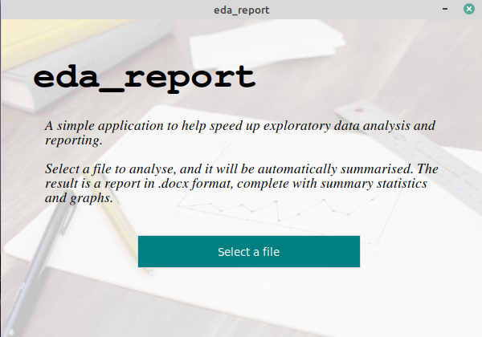

# Automated Exploratory Data Analysis

[](https://mybinder.org/v2/gh/Tim-Abwao/auto-eda/main)
[](https://badge.fury.io/py/eda-report)
[](https://github.com/Tim-Abwao/auto-eda/actions/workflows/run-tests.yml)
[](https://github.com/Tim-Abwao/auto-eda/actions/workflows/test-python3.7-3.9.yml)
[](https://eda-report.readthedocs.io/en/latest/?badge=latest)

A simple Python program to help automate EDA report generation.

The data is analysed using [pandas][1]' built in methods, and graphs are plotted using [matplotlib][3] & [seaborn][4]. The results are then packaged as a *Word .docx* file using [python-docx][5].

## Installation

You can install the package from [PyPI][6] using:

```bash
pip install eda-report
```

## Basic usage

### 1. Graphical User Interface

Recommended. Use the command

```bash
eda_report
```

and select a file to analyse.



### 2. Command line interface

To analyse a file named `input.csv`:

```bash
eda_cli input.csv
```

Or even:

```bash
eda_cli input.csv -o output.docx -c cyan --title 'EDA Report'
```

For more details on the optional arguments, pass the `-h` or `--help` flag to view the *help message*:

```bash
$ eda_cli -h
usage: eda_cli [-h] [-o OUTFILE] [-t TITLE] [-c COLOR] infile

Get a basic EDA report in docx format.

positional arguments:
  infile                A .csv or .xlsx file to process.

optional arguments:
  -h, --help            show this help message and exit
  -o OUTFILE, --outfile OUTFILE
                        The output file (default: eda-report.docx)
  -t TITLE, --title TITLE
                        The top level heading in the report (default: Exploratory Data Analysis Report)
  -c COLOR, --color COLOR
                        A valid matplotlib color specifier (default: orangered)
```

## 3. Interactive mode

```python
>>> from eda_report import get_word_report
>>> get_word_report(df)
```

where `df` is a pandas `DataFrame`.

[1]: https://pandas.pydata.org/
[2]: https://numpy.org/
[3]: https://matplotlib.org/
[4]: https://seaborn.pydata.org/
[5]: https://python-docx.readthedocs.io/en/latest/
[6]: https://pypi.org/project/eda_report/
