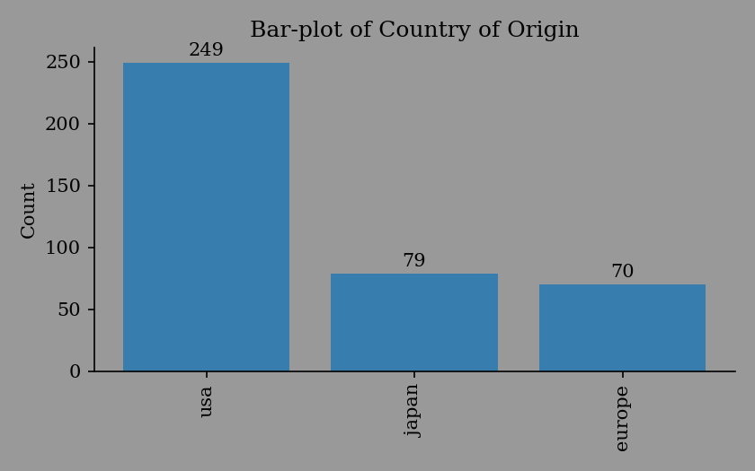
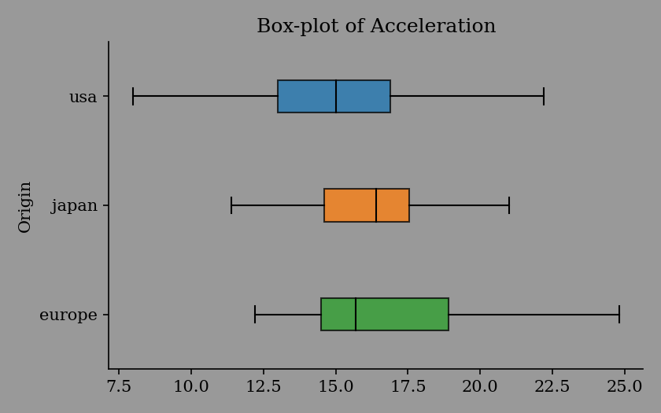
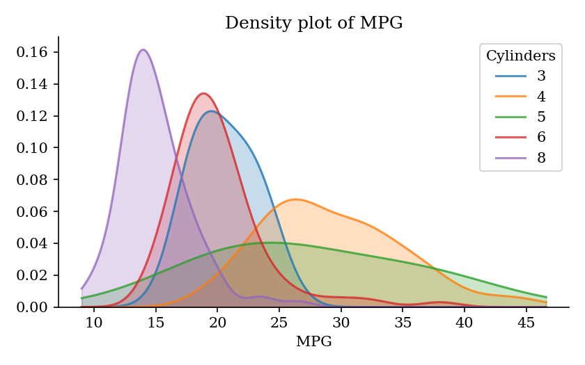
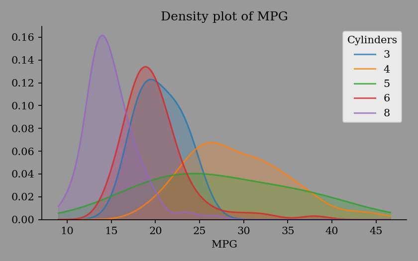
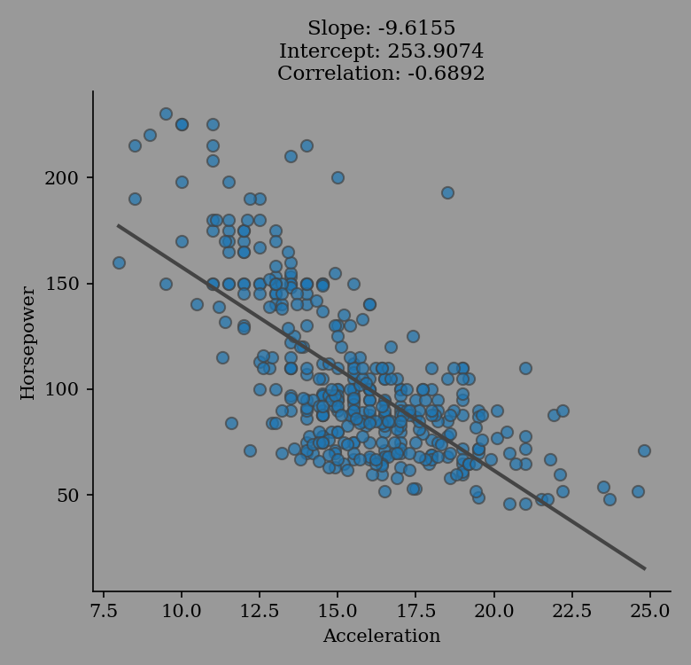
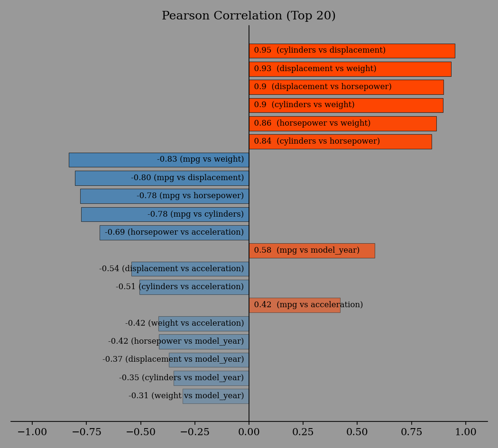

eda\_report.plotting
====================

In the interest of efficiency, especially for large datasets with numerous columns; these plotting functions use a *non-interactive* `matplotlib backend`_. This decision was inspired by `Embedding in a web application server`_, which says in part:

   When using Matplotlib in a web server [GUI application, in this case] it is strongly recommended to not use :mod:`~matplotlib.pyplot` (pyplot maintains references to the opened figures to make `show`_ work, but this will cause memory leaks unless the figures are properly closed).

.. _matplotlib backend: https://matplotlib.org/stable/users/explain/backends.html#the-builtin-backends
.. _Embedding in a web application server: https://matplotlib.org/stable/gallery/user_interfaces/web_application_server_sgskip.html
.. _show: https://matplotlib.org/stable/api/_as_gen/matplotlib.pyplot.show.html#matplotlib.pyplot.show

You can conveniently view the generated figures in a *jupyter notebook* using

   %matplotlib inline

as shown in this `demo notebook`_.

.. _demo notebook: https://mybinder.org/v2/gh/Tim-Abwao/eda-report/HEAD?filepath=eda-report-basics.ipynb

.. image:: https://mybinder.org/badge_logo.svg
   :target: https://mybinder.org/v2/gh/Tim-Abwao/eda-report/HEAD?filepath=eda-report-basics.ipynb

Otherwise, you'll probably need to export them as images.

.. _plotting-examples:

Plotting Examples
-----------------
>>> import eda_report.plotting as ep
>>> fig = ep.bar_plot(mpg_data["origin"], label="Country of Origin")
>>> fig.savefig("bar-plot.png")

>>> fig = ep.box_plot(mpg_data["acceleration"], label="Acceleration", hue=mpg_data["origin"])
>>> fig.savefig("box-plot.png")

>>> fig = ep.kde_plot(mpg_data["mpg"], label="MPG", hue=mpg_data["cylinders"])
>>> fig.savefig("kde-plot.png")

>>> fig = ep.regression_plot(mpg_data["acceleration"], mpg_data["horsepower"],
...                          labels=("Acceleration", "Horsepower"))
>>> fig.savefig("regression-plot.png")

.. image:: _static/regression-plot.png
   :width: 80%
   :align: center
   :alt: a regression-plot
   :class: only-light

>>> fig = ep.prob_plot(mpg_data["acceleration"], label="Acceleration")
>>> fig.savefig("probability-plot.png")

>>> fig = ep.plot_correlation(mpg_data)
>>> fig.savefig("correlation-plot.png")

.. image:: _static/correlation-plot.png
   :width: 80%
   :align: center
   :alt: a correlation-plot
   :class: only-light

.. automodule:: eda_report.plotting
   :members:
   :inherited-members:
   :undoc-members:
   :show-inheritance:
