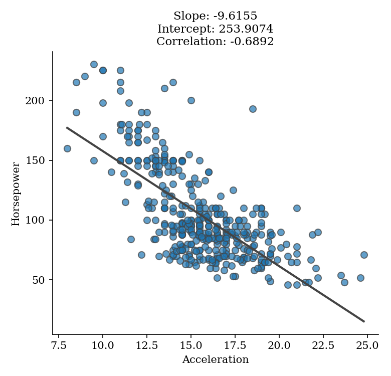

``eda-report`` User Guide
=========================

Speed up the `exploratory data analysis`_ and reporting process. Automatically analyze a dataset, and get:

1. Statistical properties
-------------------------

Descriptive statistics, bivariate analysis, tests for normality and more:

.. literalinclude:: examples.txt
   :lines: 146-171

2. Revealing visualizations
---------------------------

- *Box-plots*, *kde-plots*, *normal-probability-plots*, *scatter-plots* and a *correlation bar-chart* for numeric variables.
- *Bar-plots* for categorical variables.

>>> import eda_report.plotting as ep
>>> ax = ep.regression_plot(mpg_data["acceleration"], mpg_data["horsepower"],
...                         labels=("Acceleration", "Horsepower"))
>>> ax.figure.savefig("regression-plot.png")

.. image:: _static/regression-plot-dark.png
   :width: 80%
   :align: center
   :alt: a regression-plot
   :class: only-dark

3. A report in *Word* (.docx) format
------------------------------------

An exploratory data analysis report document complete with variable descriptions, summary statistics, statistical plots, contingency tables and more:

.. literalinclude:: examples.txt
         :lines: 136-142

.. figure:: _static/report.*
   :alt: iris dataset report animation

   A report generated from the *iris dataset*.

.. image:: https://mybinder.org/badge_logo.svg
   :target: https://mybinder.org/v2/gh/Tim-Abwao/eda-report/HEAD?filepath=eda-report-basics.ipynb

.. _exploratory data analysis: https://en.wikipedia.org/wiki/Exploratory_data_analysis

.. toctree::
   :maxdepth: 2

   installation
   quickstart
   modules

Indices and tables
==================

* :ref:`genindex`
* :ref:`modindex`
