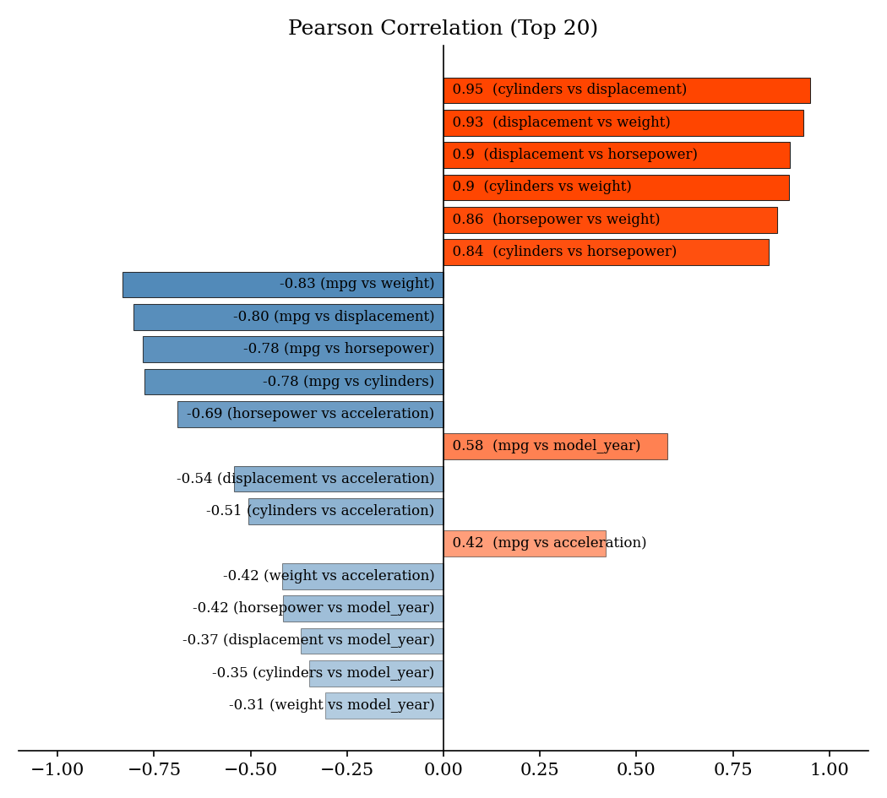
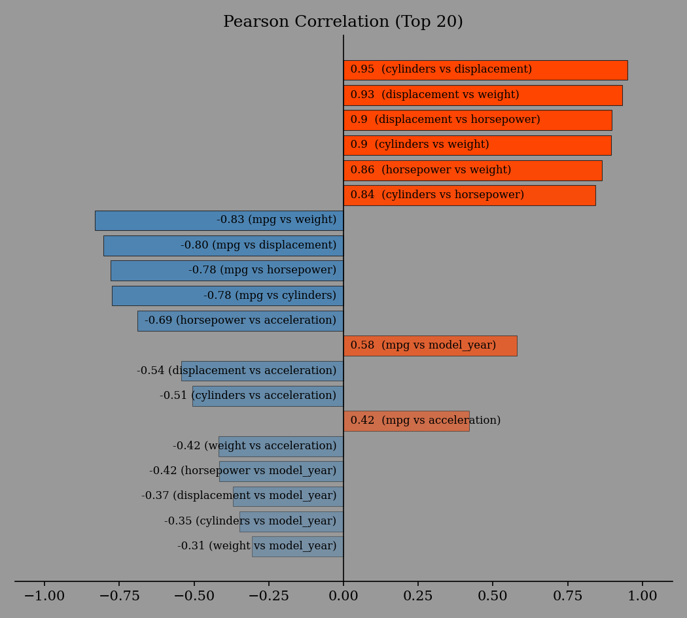

Quickstart
==========

Using the Graphical User Interface
----------------------------------

The command ``eda-report`` launches a graphical window to help select a *csv* or *excel* file to analyze::

    $ eda-report

.. figure:: _static/screencast.*
   :alt: an image of the graphical user interface

   A ``tkinter``-based graphical user interface to the application

You will be prompted to enter your desired *title*, *groupby variable(for grouping values)*, *graph color* & *output file-name*. Afterwards, a report will be generated, as specified, from the contents of the selected file.

.. hint::
    For help with `Tk` - related issues, consider visiting `TkDocs`_.

.. _`TkDocs`: https://tkdocs.com/index.html

Using the Command Line Interface
--------------------------------

You can specify the input file and an output file-name with::

    $ eda-report -i data.csv -o some_name.docx

.. literalinclude:: examples.txt
       :lines: 115-137

From an Interactive Session
---------------------------

You can use the :func:`~eda_report.summarize` function to analyze datasets:

.. literalinclude:: examples.txt
   :lines: 155-156, 159-185

You can use the :func:`~eda_report.get_word_report` function to generate reports:

.. literalinclude:: examples.txt
   :lines: 145-150

You can plot various statistical graphs:

>>> import eda_report.plotting as ep
>>> fig = ep.plot_correlation(mpg_data)
>>> fig.savefig("correlation-plot.png")

See :ref:`plotting-examples`.
