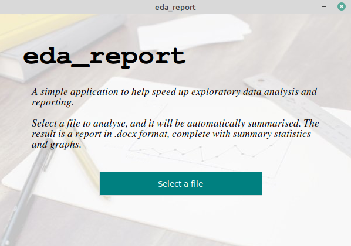

Quickstart
==========

First, install ``eda_report`` using the guidelines in :doc:`installation` (if you haven't yet).

From an Interactive Session
---------------------------

You can obtain a summary for a *single feature (univariate)* using::

    >>> from eda_report.univariate import Variable
    >>> x = Variable(range(50), name='1 to 50')
    >>> x
                Overview
                ========
    Name: 1 to 50,
    Type: numeric,
    Unique Values: 50 -> {0, 1, 2, 3, 4, 5, 6, 7, 8, 9, 10, 11, 12, 13, [...],
    Missing Values: None

            Summary Statistics
            ==================
                            1 to 50
    Number of observations  50.00000
    Average                 24.50000
    Standard Deviation      14.57738
    Minimum                  0.00000
    Lower Quartile          12.25000
    Median                  24.50000
    Upper Quartile          36.75000
    Maximum                 49.00000
    Skewness                 0.00000
    Kurtosis                -1.20000

    >>> x.show_graphs()

You can obtain statistics for a *set of features (multivariate)* using::

    >>> import seaborn as sns
    >>> from eda_report.multivariate import MultiVariable
    >>> data = sns.load_dataset('iris')
    >>> X = MultiVariable(data)
    Bivariate analysis: 100%|████████████████████████████████████████████| 6/6 [00:01<00:00,  3.85it/s]
    >>> X
            Overview
            ========
    Numeric features: sepal_length, sepal_width, petal_length, petal_width
    Categorical features: species

            Summary Statistics (Numeric features)
            =====================================
        sepal_length  sepal_width  petal_length  petal_width
    count    150.000000   150.000000    150.000000   150.000000
    mean       5.843333     3.057333      3.758000     1.199333
    std        0.828066     0.435866      1.765298     0.762238
    min        4.300000     2.000000      1.000000     0.100000
    25%        5.100000     2.800000      1.600000     0.300000
    50%        5.800000     3.000000      4.350000     1.300000
    75%        6.400000     3.300000      5.100000     1.800000
    max        7.900000     4.400000      6.900000     2.500000

            Summary Statistics (Categorical features)
            =========================================
        species
    count      150
    unique       3
    top     setosa
    freq        50

            Bivariate Analysis (Correlation)
            ================================
    sepal_length & petal_width --> strong positive correlation (0.82)
    sepal_width & petal_width --> weak negative correlation (-0.37)
    sepal_length & sepal_width --> very weak negative correlation (-0.12)
    sepal_length & petal_length --> strong positive correlation (0.87)
    sepal_width & petal_length --> weak negative correlation (-0.43)
    petal_length & petal_width --> very strong positive correlation (0.96)

    >>> X.show_correlation_heatmap()
    >>> # Generate a report document
    >>> from eda_report import get_word_report
    >>> get_word_report(data)
    [INFO 10:56:50.241] Assessing correlation in numeric variables...
    Bivariate analysis: 100%|████████████████████████████████████████████| 6/6 [00:01<00:00,  3.89it/s]
    [INFO 10:56:53.851] Done. Summarising each variable...
    Univariate analysis: 100%|███████████████████████████████████████████| 5/5 [00:01<00:00,  2.52it/s]
    [INFO 10:56:56.007] Done. Results saved as 'eda-report.docx'

Using the Graphical User Interface
----------------------------------
Use the command::

    eda_report

This launches a graphical window to help you select a **csv** or **excel** file to analyse.

   A ``tkinter``-based graphical user interface to the application

You will be prompted to configure some options (*report title*, *graph color* & *output file-name*), and a report document will be generated, as specified, from the contents of the selected file.

Using the Command Line Interface
--------------------------------

You can open and analyse **csv** or **excel** files by passing their name/path to the ``eda_cli`` command.

To process the file ``data.csv``, and save the results as ``eda-report.docx`` (*default*), use::
    
    eda_cli data.csv

You can specify the output file's name and location using the ``-o`` option::

    eda_cli data.csv -o some_name.docx

Use ``eda_cli -h`` to view all available options.
